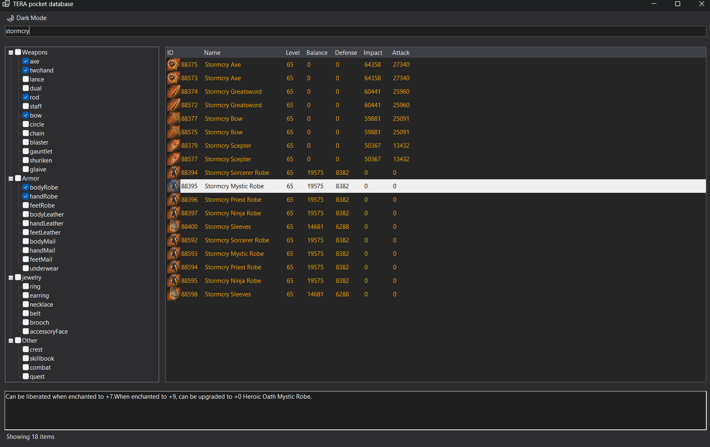

# TERA pocket database

A version-agnostic portable item database for TERA online.

How to use:

1. Download a build from the releases tab.

2. If you want a DB for 71.03 EN game version, then just launch the TERADB.exe

3. If you need a different language/game version, then unpack a client datacenter for your version of choice, then find "EquipmentData", "ItemData" and "StrSheet_Item" folders.

4. Copy the files from these folders into the "EquipmentData", "ItemData" and "StrSheet_Item" in the TERA_DB folder.

5. Delete "ItemDatabase.sqlite"

Known issues:

The search is case insensitive if you use the english language. Other languages might be case-sensitive.

The dark theme has a couple of small visual issues
